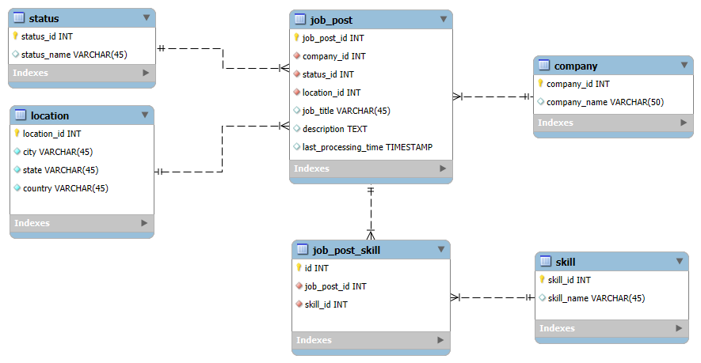

---
output:
  pdf_document: default
  html_document: default
---
# DATA607_Project3_FALL2024
This is the shared git repo for our Project 3 Team. 

## Group Members
Group members include John Ferrara, Alinzon Simon, Akeem Lawrence, and Anthony Roman. Members are listed in no particular order.

## Collaboration Tools

### Communication
As a group, our main communication tools are iMessage and Slack. There may be other means of communication used, but so far these have been our main methods.

### Code Sharing & Project Documentation
Other than collaborating on Slack, other tools to be leveraged for code sharing and project documentation are GitHub.

### Database Tools
For this project, our data will live in a MySQL database hosted on CloudSQL. The languages used to analyze this data will be R and SQL.

## The Data

### Data Source
Our group has chosen to work with a Kaggle-sourced dataset that examines job postings on LinkedIn. This data contains information such as the locations of the entities hiring, the companies performing the hiring, the job titles for the open positions, along with additional information related to the position. Additional information, and the data set itself can be found [here](https://www.kaggle.com/datasets/asaniczka/data-science-job-postings-and-skills?select=job_skills.csv). Lastly, the dataset files and their respective column names can be found in Table 1 below.

#### Table 1: Dataset Files and Columns
| File Name   | Columns                                                |
|-------------|--------------------------------------------------------|
| job_postings | job_link, last_processed_time, last_status, got_summary, got_ner, is_being_worked, job_title, company, job_location, first_seen, search_city, search_country, search_position, job_level, job_type |
| job_skills   | job_link, job_skills                                  |
| job_summary  | job_link, job_summary                                 |

## Database Structuring
The proposed normalized tables for structuring the data within the MySQL database can be seen in Figure 1 below. The image also lives [here](https://github.com/jhnboyy/DATA607_Project3_FALL2024/blob/main/additional_materials/Figure1.png) with the acutal file [here](https://github.com/jhnboyy/DATA607_Project3_FALL2024/blob/main/additional_materials/EER.mwb)

#### Figure 1: Proposed Database Table Structures

## Data Loading
Currently, the data loading process can be seen in the following [file](https://github.com/jhnboyy/DATA607_Project3_FALL2024/blob/main/loading/job_post.sql) on GitHub within our shared public repo for this project.
